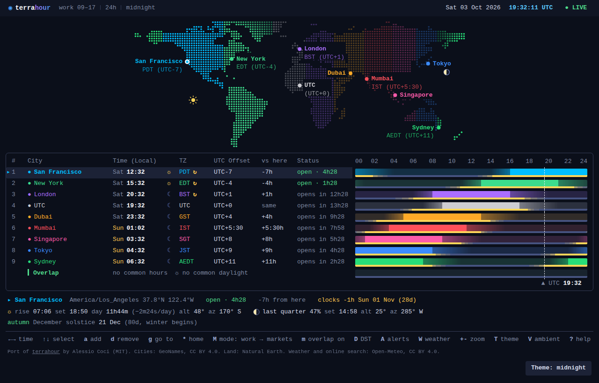

# terrahour (web)

A world clock for people who work across time zones, in a single HTML file.

It shows a dot-matrix world map with live day and night, a 24-hour timeline for every city with working hours and daylight, the hours your team has in common, upcoming clock changes, and the sun and moon for any city. Everything runs in the browser, works offline, and needs no build step, no server and no account.

**Live version:** https://[username].github.io/[repository]/

This is a browser port of [terrahour](https://github.com/ACoci86/terrahour) by Alessio Coci, a terminal world clock written in Python. The original design and logic were translated to HTML, CSS and JavaScript, and several features were added (see [What is new in the web version](#what-is-new-in-the-web-version)).

## Features

**Map**
- Dot-matrix world map, each land dot coloured by the nearest city's time zone and dimmed by night
- Sun and moon drawn where each is directly overhead; the moon shows its current phase
- Zoom with the mouse wheel or `+` `-`, drag to pan, click a city to select it

**Timeline**
- One 24-hour bar per city: bright during working hours, fading before and after
- A thin strip under each bar: yellow for daylight, grey steps for civil, nautical and astronomical twilight, blue for night
- Overlap row: the working hours and the daylight that all cities share
- Click or drag on the bars to move through time; `[` `]` zoom the timeline to 12, 6, 3 or 1 hours

**Details for the selected city**
- Open or closed now, and how long until that changes; weekends follow the city's country (for example Fri–Sat in Riyadh, Thu–Fri in Tehran, Sat–Sun by default)
- Offset from your home city, the next daylight-saving change, and warnings when the gap to home will shift
- Sunrise, sunset, day length and its daily change, and the sun's altitude and compass direction now
- Moon phase, illumination, moonrise, moonset, and the moon's altitude and direction now

**Other views and tools**
- Stock exchanges: 10 major exchanges with their trading sessions and lunch breaks
- DST radar: every city's next clock change and how it affects the gap to your home city
- Alerts: a daily time in a city, when a city's working day or an exchange opens or closes, or a simple timer
- Ambient view: a full-screen clock that cycles through your cities
- Six themes (midnight, nord, dracula, light, mono, colour-blind friendly), 12- or 24-hour clock, compact layout
- About 12,000 cities built in; search by city, country or time zone name (for example `naples`, `new zealand`, `Asia/Tokyo`)

## Using it

Open `index.html` in a modern browser, or visit the live version. Settings, your city list and your alerts are saved in your browser (localStorage) and never leave your device.

On touch screens, the key hints along the bottom are buttons.

### Keys

| Key | Action |
|---|---|
| `←` `→` | Move time by 15 minutes (`Shift` for 1 hour) |
| `PgUp` `PgDn` | Move time by 1 day |
| `g` | Go to a time: `15:30`, `3pm`, `15:30z` (UTC), `+2h`, `2026-10-05 09:00` |
| `r` or `Home` | Back to live time |
| `↑` `↓` or `j` `k` | Select a row |
| `Shift` `↑` `↓` or `J` `K` | Move the selected city up or down |
| `a` / `d` | Add / remove a city |
| `Enter` | Focus on the selected city |
| `*` | Set or clear your home city |
| `w` | Cycle working hours: 09–17, 08–18, 10–19, 07–15 |
| `M` | Switch between cities and stock exchanges |
| `m` | Overlap row on or off |
| `D` | DST radar |
| `A` | Alerts |
| `W` | Weather off, °C, °F |
| `T` / `t` | Next theme / 12- or 24-hour clock |
| `c` | Compact layout: auto, on, off |
| `V` | Ambient view |
| `+` `-` / `[` `]` / `0` | Zoom the map / zoom the timeline / reset both |
| `Z` | Mouse wheel zooms or moves time |
| `?` | All keys |

## Publishing your own copy with GitHub Pages

1. Put `index.html` in the root of the repository (keep the empty `.nojekyll` file next to it).
2. In the repository, open **Settings → Pages**.
3. Under **Build and deployment → Source**, choose **Deploy from a branch**, then select `main` and `/ (root)`.
4. After a minute the site is live at `https://[username].github.io/[repository]/`. Every push to `main` republishes it.

GitHub Pages is free for public repositories. Opening `index.html` on github.com itself only shows the source code.

## Accuracy

| What | Method | Typical accuracy |
|---|---|---|
| Time zones and daylight-saving rules | The browser's built-in time zone database (`Intl`) | As current as the browser |
| Sunrise, sunset, day/night | NOAA solar approximation | About 1–2 minutes at mid-latitudes |
| Moon position, phase, rise and set | Low-precision lunar formulas (as in the SunCalc library) | Phase within about 1%, rise and set within a few minutes |

These are good for planning and curiosity, not for navigation or astronomy.

## Network use and privacy

The app makes no network requests by default apart from loading the JetBrains Mono font from Google Fonts. Two optional features call [Open-Meteo](https://open-meteo.com/):

- **Weather** (press `W`), for the cities on your list
- **Online city search**, only when you type a name that is not in the built-in list

Open-Meteo's free service is for non-commercial use; commercial use needs one of their paid plans. Without network access, both features simply stay quiet and everything else keeps working.

## What is new in the web version

Compared with the original terminal app:

- Runs in any browser, on desktop and mobile, with mouse and touch support
- Day/night strip under every timeline bar, and shared daylight in the overlap row
- Weekends: cities are closed on weekends, with country-specific weekend days
- Moon: phase, illumination, moonrise, moonset, position, and a marker on the map
- Sun and moon altitude and compass direction for the selected city
- Daily change in day length
- Dot-matrix digits in the ambient view

Some terminal-specific parts were left out or replaced: the config file became browser storage, and terminal notifications became browser notifications with a short beep.

## Credits

- Original terrahour: [Alessio Coci](https://github.com/ACoci86/terrahour), MIT License
- City list: derived from [GeoNames](https://www.geonames.org/), CC BY 4.0
- Land mask: rasterised from [Natural Earth](https://www.naturalearthdata.com/), public domain
- Weather and online geocoding: [Open-Meteo](https://open-meteo.com/), CC BY 4.0
- Font: [JetBrains Mono](https://www.jetbrains.com/lp/mono/), SIL Open Font License

## License

MIT. See [LICENSE](LICENSE). The original copyright notice of Alessio Coci is kept, as the MIT License requires.
